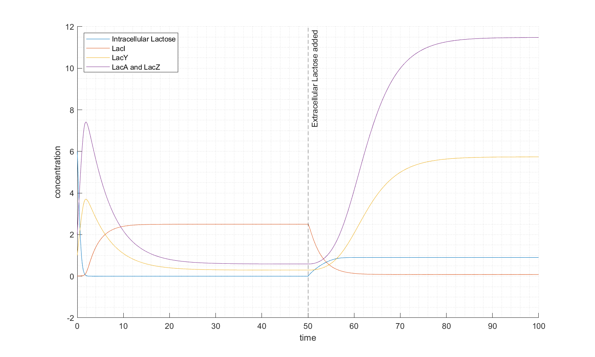

# Biosystems Engineering
## Modelling of Lac operon and its response to extracellular lactose
### See [this document](Results/biosystems_engineering_584833_583875.pdf) for a detailed report.
The evolution over time of the system is shown below, with arbitrary initial conditions and extracellular lactose added after t = 50.

